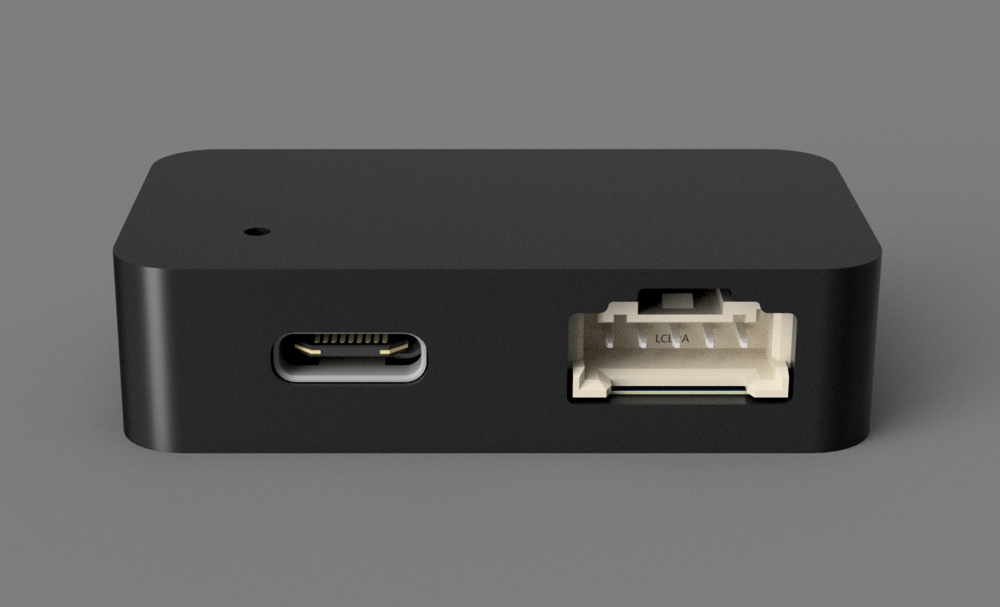

# 💫 Toshiba x ESP32-C6 UART Bridge
### 🌬️ ESPHome UART-to-WiFi Interface Board for Toshiba Air Conditioners

Toshiba x ESP32-C6 UART Bridge is a compact interface board designed for compatible Toshiba air conditioners.  
It connects to the internal **CN22 UART connector** and allows ESPHome / Home Assistant to read the real AC state and send control commands over UART.

The board is built around the **Seeed Studio XIAO ESP32-C6** and is intended to provide a clean wired alternative to IR-only control.

## 🔗 Project Links

- 🧩 OSHWLab / EasyEDA Project: [Open Online](https://oshwlab.com/xqvc/toshiba-x-esp32c3-bridge)
- 🗂️ Gerber Files: [Download Gerber](hardware/GERBER%20-%20Toshiba%20x%20ESP32C6%20UART%20Bridge%20v1.0%20-%20Rev%20A.zip)
- 📄 Schematic PDF: [View Schematic](hardware/SCHEMATIC%20-%20Toshiba%20x%20ESP32C6%20UART%20Bridge%20v1.0%20-%20Rev%20A.pdf)
- 📦 BOM: [Download BOM](hardware/BOM%20-%20ESP32C6%20UART%20Bridge%20v1.0%20-%20Rev%20A.xlsx)
- 🧾 Pick and Place: [Download PnP](hardware/PickAndPlace%20-%20Toshiba%20x%20ESP32C6%20UART%20Bridge%20v1.0%20-%20Rev%20A.xlsx)
- 🖨️ 3D Printable Enclosure: [Download 3MF](hardware/Toshiba%20x%20ESP32C6%20Bridge%20Enclosure.3mf)

## ✨ Features

- **Seeed Studio XIAO ESP32-C6**
- **ESPHome** firmware configuration
- Toshiba AC control over internal **CN22 UART**
- Real AC state feedback, not just IR commands
- Home Assistant API support
- OTA update support after first USB flash
- Wi-Fi fallback access point
- AC Wi-Fi LED control
- Off timer support
- Compact custom PCB design

## 🔧 Hardware Overview

The board connects the **XIAO ESP32-C6** to the Toshiba indoor unit through the internal **CN22 UART** connector.

UART settings used by the firmware:

    Baud rate: 9600
    Parity: EVEN
    ESP32 TX: GPIO1
    ESP32 RX: GPIO0

Connection direction:

    ESP32 TX -> Toshiba RX
    ESP32 RX <- Toshiba TX

Always check your own AC unit's CN22 pinout before connecting the board.

## 🧠 Firmware

The firmware is based on **ESPHome** and uses the external Toshiba Suzumi ESPHome component:

https://github.com/pedobry/esphome_toshiba_suzumi

Firmware files are located in:

    firmware/esphome/

Main configuration:

    firmware/esphome/toshiba-uart.yaml

Before compiling, edit the placeholder secrets file:

    firmware/esphome/secrets.yaml

Do not commit real Wi-Fi credentials if you fork or modify this repository; untrack `firmware/esphome/secrets.yaml` and add it to `.gitignore` before entering real values.

## 🧪 Compatibility

This board has only been tested with a **Toshiba Seiya** air conditioner.

It will likely work with other Toshiba air conditioners that use the same internal **CN22 UART** interface, but this has not been verified.  
Always check your own unit's connector, pinout, and documentation before connecting the board.

## 🖼️ Images

### PCB

### Enclosure

### Renders

### Connected to AC

## ⚠️ Safety

This board is only intended for the **low-voltage UART interface side** of the air conditioner.

- Disconnect AC power before opening the air conditioner.
- Do not work on the unit while it is connected to mains power.
- Do not connect this board to mains voltage.
- Check the PCB for solder bridges, missing parts, wrong parts, or damaged components before powering it.
- Verify the fuse with a multimeter continuity test.
- Check the Schottky diode direction before powering the board.
- Confirm connector orientation and cable order.

**NEVER connect USB power while the board is connected to the air conditioner.**  
The Schottky diode helps prevent current from feeding back into the air conditioner interface, but it does not protect the USB connector side. With both connections present, the air conditioner side may backfeed into the USB port, which can damage your computer, the board, or the AC control board, and may also blow the onboard fuse.

Use this hardware at your own risk.

## 📜 License

This repository uses separate licenses for hardware and firmware.

### Hardware

Hardware design files are licensed under the **CERN Open Hardware Licence Version 2 - Strongly Reciprocal (CERN-OHL-S-2.0)**.

See [`LICENSE_HARDWARE`](LICENSE_HARDWARE) for details.

### Firmware

Firmware and ESPHome configuration files are licensed under **GPL-3.0-only**.

See [`LICENSE_SOFTWARE`](LICENSE_SOFTWARE) for details.

The external Toshiba Suzumi ESPHome component is licensed by its original author under the **GNU General Public License v3.0**.

## ⚠️ Disclaimer

This project is provided for educational and personal use.

The author takes no responsibility for any damage, misuse, electrical faults, AC unit damage, computer damage, or installation mistakes.  
By using this hardware and firmware, you agree that all responsibility is yours.

This project is provided **"as-is"** without any warranty.

## 👨‍💻 Author

Designed by **Yiğit Alp Eltutan (biscuitdev)**
